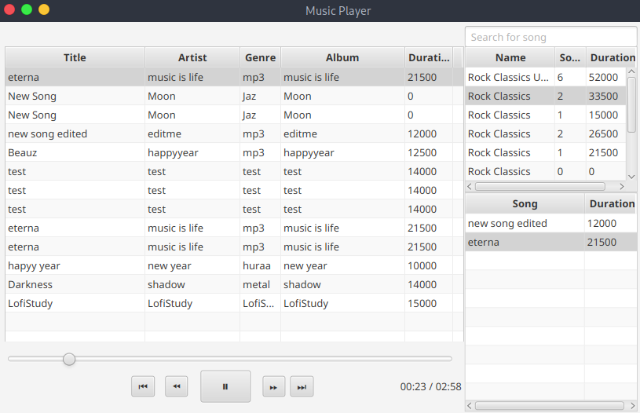

# iTunes Music Player



## Description

This project is a desktop music player built with JavaFX and Maven. It provides a simple interface for managing songs, organizing playlists, and playing local audio files through a home screen that combines the song library, playlist overview, and playback controls in one window.

The application is structured around a layered Java project with GUI, business logic, and data access components. Songs and playlists are loaded into table views, users can search for tracks, create and edit playlists, and control playback with play/pause, previous, next, and skip controls.

## Main Features

- Browse a song library in the main table view
- Search for songs from the home screen
- Create, edit, and delete songs
- Create, edit, and delete playlists
- Add songs to playlists and view playlist contents
- Play songs with progress tracking
- Use previous, next, forward, and backward playback controls

## Technologies

- Java
- JavaFX
- Maven
- Microsoft SQL Server JDBC driver

## Run The Project

Make sure you have Java and Maven available, then run:

```bash
mvn clean javafx:run
```
